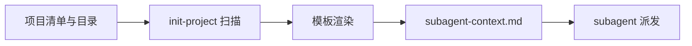

# Subagent 上下文模板

> ⚠️ 此文件为模板定义，不直接用于 subagent。实际使用时由 /loom-init-project 渲染后生成 `.loom/contexts/subagent-context.md`

## 用途

Subagent 隔离派发时注入的项目上下文，提供最精简的约束信息，减少 token 消耗。

## 模板

实际生成文件保持紧凑，只包含可从项目清单和目录直接确认的事实：项目名、技术栈、架构提示、构建/检查/测试命令、事实来源和 constitution SHA-256。

它还声明固定的可信度顺序：当前源码和命令输出 > 已批准 spec/constitution > handoff。错误处理、响应、日志、DI 等无法机械确认的模式不再写入生成上下文；agent 仅在当前 task 需要时定向读取源码。

## 字段来源

| 字段 | 来源 | 不确定时的处理 |
| ---- | ---- | -------------- |
| 技术栈与命令 | package.json / go.mod 等项目清单 | 标记 UNKNOWN，使用前检查配置 |
| 架构提示 | 最多两层目录名 | 明确标为 hint，使用前核对源码 |
| constitution 指纹 | constitution.md 内容 SHA-256 | 不匹配时由 doctor / pipeline 阻断 |

## 使用方式

1. `/loom-init-project` 生成 `.loom/contexts/subagent-context.md`
2. subagent-driven-development 派发时读取此文件注入 subagent prompt
3. 项目特有长期约束写入 constitution.md，随后重新运行 init-project 刷新上下文

## 生成逻辑

`/loom-init-project` 时：

1. 扫描项目获取技术栈信息
2. 记录事实来源，不能确认的字段标为 UNKNOWN
3. 计算宪章 SHA-256，用于过期检测
4. 生成紧凑 `.loom/contexts/subagent-context.md`；具体源码模式按 Requirement ID 定向读取
